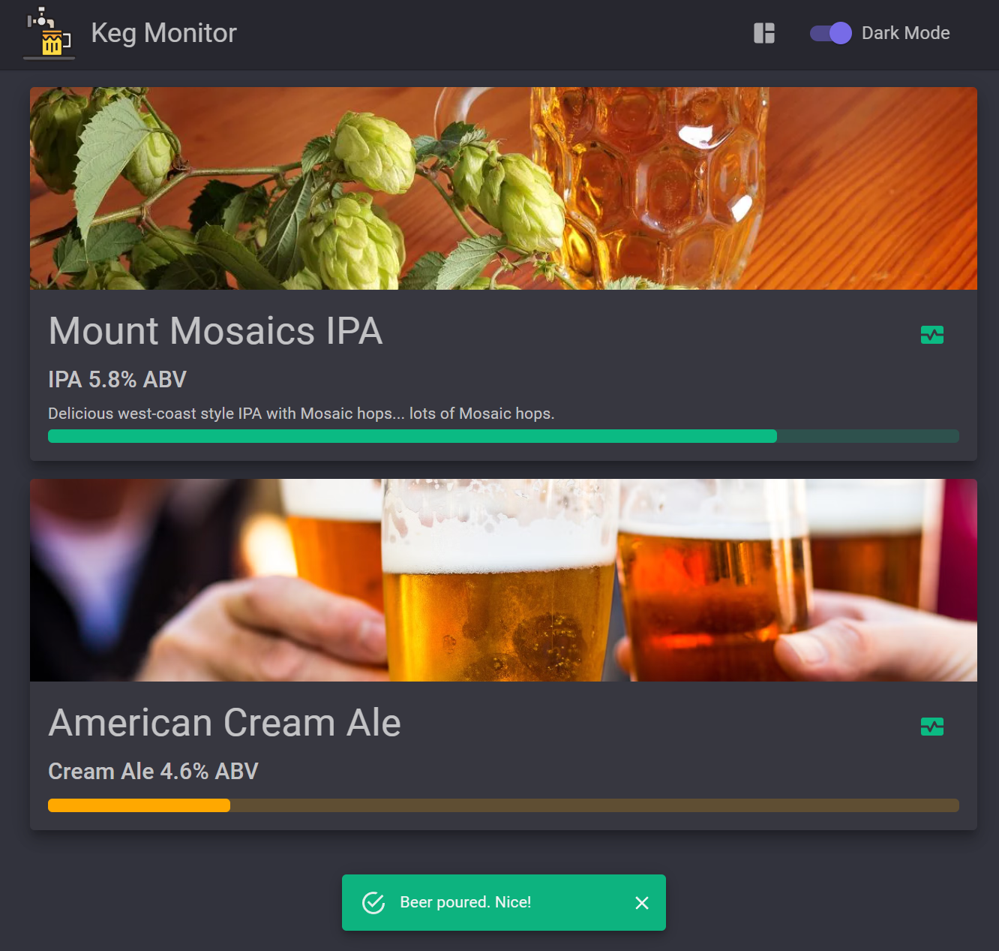
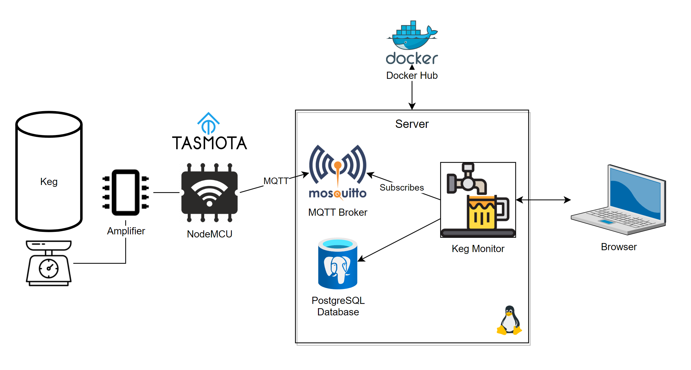
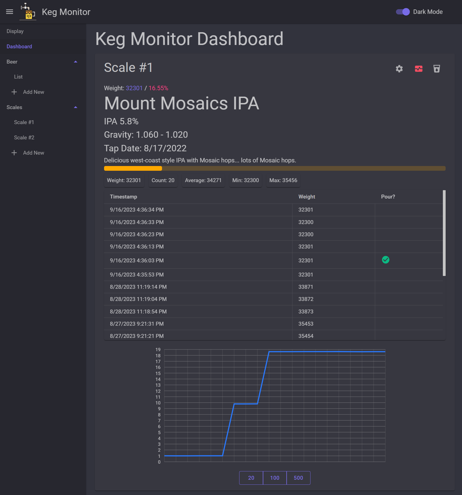
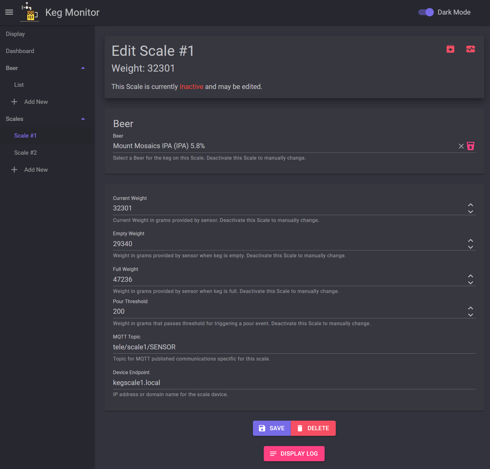
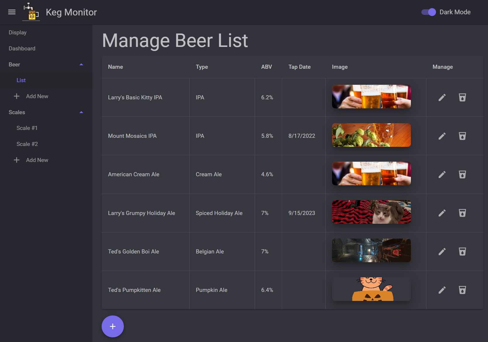

#  Keg Monitor 

Keg monitoring and management system using an MQTT broker and IoT smart scales to report keg weight values and changes. Compliment a kegerator with this system to display what beer is on tap, how much beer remains within each keg, and detect when a beer is poured.

[](https://dev.azure.com/sethsteenken/KegMonitor/_build/latest?definitionId=3)
[](https://hub.docker.com/r/sethsteenken/kegmonitor)
[](https://hub.docker.com/r/sethsteenken/kegmonitor)



## Inspirational Credit

After homebrewing for many years, I was able to acquire a kegerator with two taps to enjoy the beer I would brew. Gone are the bottling days! After a year or so of not really knowing how much was left in a keg, I wanted to have a more sophisticated and technically focused solution. This project was born.

Also, massive shoutout and credit to Matt over at the [Troubled Brewing YouTube Channel](https://www.youtube.com/@TroubleBrewing/featured) for the [instructional video](https://www.youtube.com/watch?v=QF1B8yD9jy4) on building the smart scales that helped jumpstart this project. Seriously could not have completed this project without Matt's amazing video.

## Architecture

The Keg Monitor application is a [.NET Blazor](https://dotnet.microsoft.com/en-us/apps/aspnet/web-apps/blazor) web application that is compiled via a Dockerfile to run as a container. The [latest container image](https://hub.docker.com/r/sethsteenken/kegmonitor) for the application is pulled from Docker Hub when deploying. The keg scale readings come from load cells connected to an amplifier which connects to a microchip like a NodeMCU. The microchip connects to the network wirelessly to periodically push the current weight reading from the load cells via the MQTT protocol. These readings are received by an [MQTT broker](https://mosquitto.org/). The Keg Monitor application subscribes to this broker in order to be notified of weight changes. A [PostgreSQL](https://www.postgresql.org/) database is used by the application to store weight changes and beer data.



## Getting Started

Getting the full keg monitoring application and dependences installed and running will require some hardware, minor technical and networking knowledge, and some beer of course.

### Prerequisites

* Keg(s) in a kegerator connected to a tap
* Smart scales using load cells with amplifier and microchip
  * Search online for 50kg Load Cell (pack of 4) with HX711 Amplifier
  * Wood plate on which to install load cells. See this [instructional video](https://www.youtube.com/watch?v=QF1B8yD9jy4) for building instructions and IoT setup.
* Linux machine to host application
  * It is recommended to run Linux and the commands below will be for Linux distributions; however, Windows can be supported running Docker for Windows or using WSL.
  * [Docker](https://www.docker.com/) or other flavor of running containers

### Installation

First, clone the repository or copy out the [docker-compose.yml](/docker-compose.yml). 

```
git clone https://github.com/sethsteenken/keg-monitor.git
```

Create new directory and copy docker-compose.yml.

```
mkdir server
cp docker-compose.yml /server/docker-compose.yml
```

Create an .env file in this directory. Note: you will not see the file in the directory.

```
touch .env
```

Set .env with the following content. Fill in the empty environment variables with values related to your setup. Feel free to change any of these defaults.
```
MQTT_HEALTH_PROBE_USER=healthcheck_user
MQTT_HEALTH_PROBE_PASSWORD=<password for health probe for the mqtt broker>
POSTGRES_USER=<postgres user>
POSTGRES_PASSWORD=<postgres password>
POSTGRES_VERSION=15.4
KEGMONITOR_CONN_STRING="Host=postgresql;Database=keg-monitor;Username=<postgres user>;Password=<postgres password>"
KEGMONITOR_DOMAIN=<custom local domain or IP address for the web application>
KEGMONITOR_MQTT_PASSWORD=<password for the mqtt broker app user>
TIMEZONE=America/New_York
```

Deploy the application and dependent containers using [Docker Compose](https://docs.docker.com/compose/)

```
sudo docker compose up -d
```

The containers should deploy successfully, but may result in unhealthy or stopped status. Perform the following setup steps:

### Additional Setup Steps

* Run commands on the MQTT broker container to establish the following:
  * health probe user healthcheck_user
  * web app user keg_monitor_web_user
  * client KM_Web_Sub
  * See [documentation for the MQTT broker](https://mosquitto.org/)
* Setup PostgreSQL
  * Test connection to Postgres by using [pg_ready](https://www.postgresql.org/docs/current/app-pg-isready.html) or [psql](https://www.postgresql.org/docs/current/app-psql.html) directly.
* Connect IoT load cells to broker  
  * Follow the last half of Matt's [instructional video](https://www.youtube.com/watch?v=QF1B8yD9jy4) to configure the load cells to report current weight to a broker
  * In place of the Home Assistant configuration, simply use Tasmota to configure and point the load cell readings to the Mosquitto MQTT Broker container (host IP address with port 1883)

### Docker Troubleshooting

Review [Docker commands](https://docs.docker.com/engine/reference/commandline/cli/) (there's also a [cheat sheet](https://docs.docker.com/get-started/docker_cheatsheet.pdf) for these) to troubleshoot containers that may fail to start.

Can optionally install a GUI application like [Portainer](https://www.portainer.io/) to help manage your containers.

## Features

Dashboard to view detailed keg scale information, weight changes, connection status, and pours at a glance. Review weight recordings and average calculations to note differences in subtle weight changes due to varying temperatures in the kegerator.



Display page to display active keg scales, the beer in those kegs, percentage remaining, and a pour popup indicator.


Add and edit scales for as many kegs as you need



And keep a list of beers to assign to your keg scales


